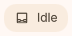
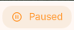
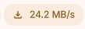
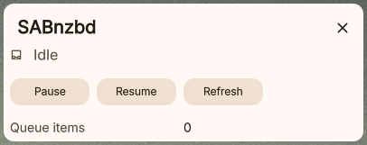
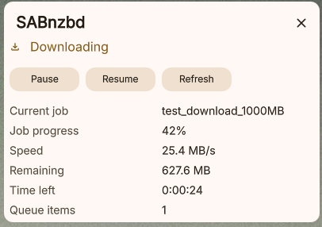

# SABnzbd Monitor

A DankMaterialShell plugin that monitors your [SABnzbd](https://sabnzbd.org/) download queue and displays the current status in your status bar.

## Features

- Shows current queue status: **Downloading**, **Paused**, or **Idle**
- Displays live download speed when active
- Popout panel with remaining size, time left, and queue item count
- Current job name and progress in the popout
- Queue controls in popout: **Pause**, **Resume**, and **Refresh**
- Configurable refresh interval with exponential backoff when unreachable
- Optional compact pill modes: `full`, `text`, or `icon`

## Setup

1. Open plugin settings.
2. Set the **SABnzbd URL** (default: `http://localhost:8080`).
3. Enter your **API Key** — find it in SABnzbd under **Config → General → API Key**.
4. Optional settings:
	- **Refresh Interval (seconds)**: 2-60
	- **Pill Mode**: `full`, `text`, or `icon`

## Requirements

- SABnzbd must be reachable from the host running DankMaterialShell.

## Screenshots

### Dankbar States

Idle

Paused

Downloading with speed

### Popout Panel

Idle popout

Downloading popout

